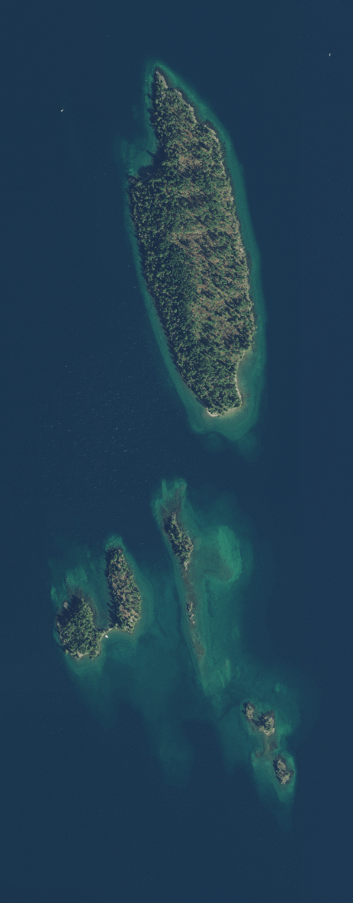

---
title: Bird Island
date: "2019-09-13T23:46:37.121Z"
description: An island for birds
---

Finley Point to Bird island.
I've waited 30 years for this.

As the week drew to a close, I started formulating a plan.  My wife and kids were heading out on Saturday  to a weeklong camp in Idaho called Rabbit Stick.  With the weekend to myself, but not wanting to get into too much adventure, I decided to head to Flathead lake and camp on Bird island.  The Zuma will be perfect for this trip due to the solo aspect, and ease of setup. 

Bird island has a long history to it.  It has operated as a bird sanctuary since the 1950s, and people were prohibited from the island.  I believe the original intent was for the preservation of Canada geese, which seemed to work out well for the species.  Camping with my parents while growing up, we would drive the boat over and pick up driftwood off the shore and bring it back to Blue Bay for firewood.  We were always careful to not step onto the island too far due to the bird sanctuary bit of it.

Flash forward to 2018.  While on our sailing lesson over in Big Arm Bay, our instructor (who looked to be about 20 years old) was telling us of the islands that you could camp on in Flathead lake.  Bird island was one of them.  Ha!  Quite laughable, due to the bird sanctuary bit of it, we told him he was in the wrong.

But he wasn’t wrong, in 1997 they started letting people back on the island; my information was over 20 years old.  In fact, it had been open to the public for probably his entire life.  I don’t think I have ever felt so old as when I came to this realization.

Anyway, back to the present.  Friday night, I take the kids, and meet up with Lance and Reuben  at the Guild brewery for some tacos and video games.  I mention my weekend plans to Lance, and he wants in (if he can clear it with his wife).  The Zuma would be tight for 2 + gear, so we take the SolCat.

Lance showed up on Saturday morning, we got the gear loaded up, and we hit the road.  The 1.5 hour drive to Finley Point was uneventful.  Traffic at the ever popular Finley Point state campground was muted due to September, and we were able to step the mast without incident.  It is much easier to have two people step the mast than stepping it singlehanded.  We had three dry bags in total, and we opted to just lash them to the front of the tramp instead of building up the spiderweb structure like we had with the Yellowstone trip.

I held the boat at the marina while Lance went and parked the truck.  Not trusting the winds while in the marina, we opted to paddle out to open water to raise the mainsail.  Wind was light until we got out of Polson bay and into the main lake.  From there it was a straight shot to Bird Island.

As we approached Bird island, we could see that there was a boat beached on the southern tip.  That was where we were planning on camping.  We decided to sail around the island to check it out, and in hopes that the boat would have left by the time we got back.  Most of the shoreline of the island is solid rock, and ill fit for beaching a boat.  As we rounded the northern shore, the other landing spot came into view; it was also populated with a boat.  This northwestern beach looked  quite nice for camping, and we decided to make a loop around the island one more time to see if the people on that beach would be taking off.

In the end we decided to just beach the SolCat next to the boat on the northwestern shore, but as we were approaching, the people boaters started to shove off.  We had noticed a rope swing on our way in, and inquired if it was any good.  Yes, was the answer, as long as you kept your legs up.

After securing the SolCat, we grabbed our masks and snorkels, and headed for the rope swing.  After jumping in several times, we decided to snorkel to the north.

Bird Island has the best snorkeling that I have ever done on Flathead lake.  The terrain is solid rock that plunges off into deep abysses, and juts back up without warning.  This keeps you wanting to see what is around the next corner.  

We did just that.  Every once in a while we would stop, and decide to keep on to the next outcropping to check it out.  Again and again.  After the first couple times, I knew we were going to swim around the island.  The solid rock was great for grabbing on and launching yourself forward, or boosting off with your feet.

Lance was quite a bit faster than me.  He had the distinct advantage of a pair of flippers as compared to my pair of crocs.  My own flippers were deep inside of my tent trailer at the house, and I opted not to bother opening it up to get them.  Instead I borrowed Ember’s mask and snorkel, but her fins would not fit.  

We made it all the way around (about 1 mile), got back to the boat, and decided to set up the hammocks and make some dinner.  With our complete lack of planning for the trip, Mountain House to the rescue again, along with some dried apples, raspberries, and peaches that Lance’s wife had made.

Just as we were getting some driftwood to start a fire, a motorboat comes around the corner, slows down, and heads for the shore.  They ask if we mind if they stop for a few, they want to take in the sunset.  Of course we didn’t, so we helped catch the boat, took some group photos for them, shared a red solo cup of their malbec, and helped push the boat out when they were ready.  Overall, quite an enjoyable interaction.

We had a fire right on the beach, split a 6 pack of beer, and turned in for the night.  The following morning, we loaded the boat up (after getting some coffee) and headed back to the mainland.  Winds were light, but we did not have to resort to paddling.  Overall the weather was spectacular for mid September, and the snorkeling was the high point.  When we do this trip next time, I’ll bring flippers and I’d like to explore off the shores of some of the smaller islands to the south.

<!-- Docs to Markdown version 1.0β17 -->
